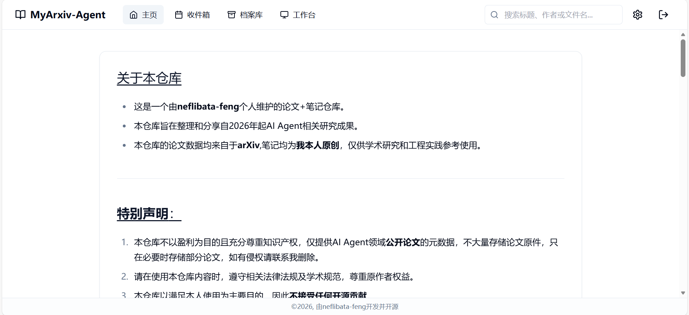
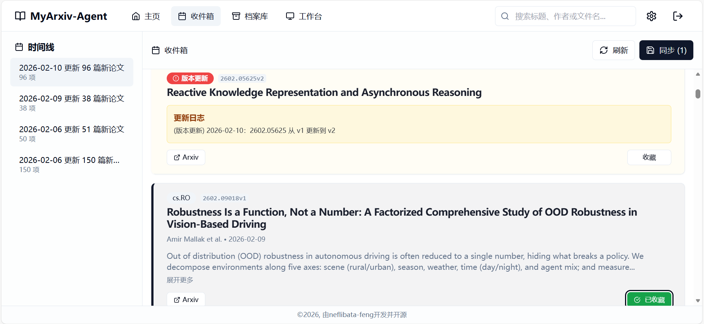
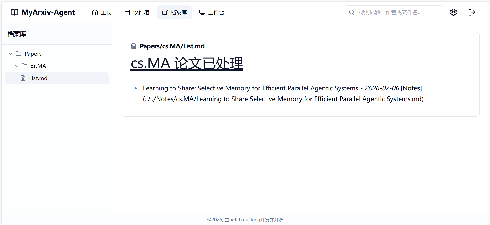
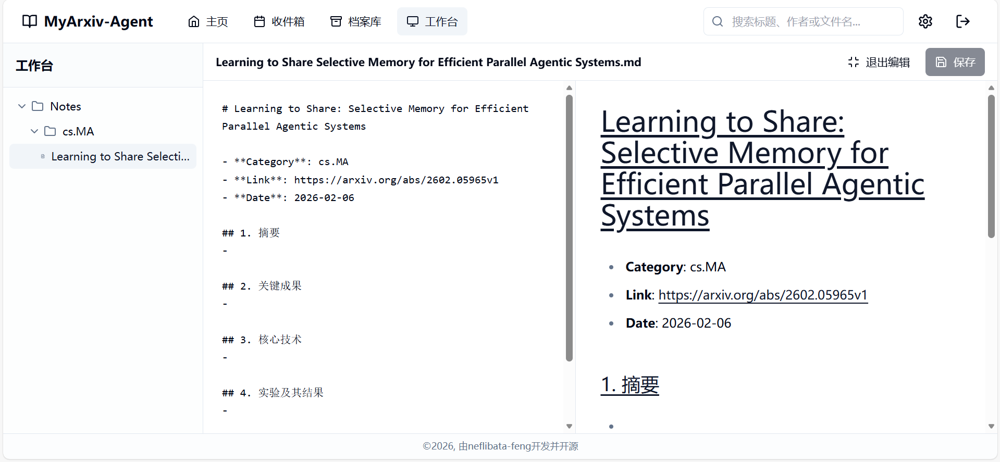
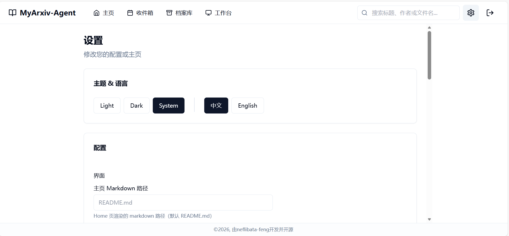

<p align="center">
  
</p>

<p align="center">
  <a href="https://github.com/neflibata-feng/MyArxiv-Agent/actions/workflows/daily_scheduler.yml?query=branch%3Amain"></a>
  <a href="https://github.com/neflibata-feng/MyArxiv-Agent/actions/workflows/auto_archive.yml?query=branch%3Amain"></a>
  <a href="https://github.com/neflibata-feng/MyArxiv-Agent/actions/workflows/deploy-web.yml?query=branch%3Amain"></a>
  <a href="LICENSE"></a>
  <a href="LICENSE-APACHE"></a>
</p>

<p align="center">
  <strong>中文</strong> · <a href="README.en.md">English</a>
</p>

## 关于本仓库

- 这是一个由**neflibata-feng**个人维护的论文+笔记仓库。
- 本仓库旨在整理和分享自2026年起AI Agent相关研究成果。
- 本仓库的论文数据均来自于**arXiv**,笔记均为**我本人原创**，仅供学术研究和工程实践参考使用。
  
---

## 许可说明

- **内容许可**：仓库内的整理内容与文字材料（如 `Notes/`、Markdown 文档、截图等）遵循 **CC BY-NC-SA 4.0**，见 [LICENSE](LICENSE)。
- **架构与代码许可**：自动化框架与代码（如 `scripts/`、`web/`、`.github/workflows/` 等）采用 **Apache-2.0**，见 [LICENSE-APACHE](LICENSE-APACHE)。

> 注：论文的版权归原作者与出版方所有；本仓库仅做学习研究与工程实践整理。

---

## **特别声明**：

1. 本仓库不以盈利为目的且充分尊重知识产权，仅提供AI Agent领域**公开论文**的元数据，不大量存储论文原件，只在必要时存储部分论文，如有侵权请联系我删除。
2. 请在使用本仓库内容时，遵守相关法律法规及学术规范，尊重原作者权益。
3. 本仓库以满足本人使用为主要目的，因此**一般不接受其他贡献**。
4. 但是秉持着开源和共享的精神，依然欢迎大家浏览本人整理的论文和笔记（可以**star**哦）
5. 同时本仓库依然可以作为个人arXiv自动化论文知识空间的模板，你可以**fork**本仓库并根据自己的需求进行修改和使用。

---
## 页面展示

- 
- 
- 
- 
- 

---

## 仓库结构

```plaintext
/
├── .github/             # GitHub Actions 自动化配置
├── scripts/             # 自动化脚本
├── assets/              # 图片等静态资源
├── Inbox.md             # 收件箱 (每日更新入口)
├── Contents.md          # 总目录 (自动生成)
├── pdfs/                # 论文PDF存储（可选）
├── Papers/              # 论文元数据归档  
├── Notes/               # 个人笔记与思考
├── config.yaml          # 全局配置文件
├── .gitignore           # Git 忽略规则
├── web/                 # 网页端源码
├── LICENSE              # 内容许可证文件
├── LICENSE-APACHE       # 代码许可证文件
└── README.md            # 仓库介绍
```
---

## 使用指南

### 核心流程和使用步骤

1. **每日抓取**：每日固定时间（默认为北京时间8：30）自动抓取特定领域（默认为AI Agent）最新论文至 `Inbox.md` 待阅读区。默认最大抓取量为每日最新的150篇论文，且有去重机制，确保不遗漏任何更新。
2. **审阅与筛选**：在 `Inbox.md` 中，支持将感兴趣的论文标记为对钩。系统会自动将其剪切处理，对于不感兴趣的论文，可以直接删除对应行，系统会忽略这些论文。长期使用请定期清除 `Inbox.md` 中的旧条目以保持整洁。
3. **自动归档**：提交 `Inbox.md` 的更改后，系统会自动：
   - 将选中的论文归档至 `Papers/`。
   - 在 `Notes/` 创建对应的笔记模板。
   - 更新 `Contents.md` 目录索引。


### 全局配置

仓库根目录提供 `config.yaml` 用于集中管理抓取、去重、格式化、归档与索引等参数。
- 常见可配置项：关注分类与关键词、抓取数量、摘要截断长度、Inbox/Contents 生成模板、归档目录结构等。
- GitHub Actions 默认会直接使用该文件，无需额外改动。

> **arXiv API 参数补充说明**
> - `fetch.query.id_list`：可选。指定 arXiv id（支持 `vN` 版本号）；支持 YAML 列表或逗号分隔字符串。仅提供 `id_list` 时按 id 精确拉取；若同时提供查询条件，则按官方语义取交集（过滤）。
> - `fetch.formatting.date_source`：可选 `published`/`updated`；分别对应 Atom 的 `<published>`（v1）与 `<updated>`（当前版本）。
> - `features.arxiv_version_update_behavior`：`append_notice` 追加“版本更新提示”；`replace` 会把 Inbox 中旧版本 `abs` 链接替换为新版本链接，并同样追加提示。

### 提供环境变量覆盖供选择

支持用环境变量覆盖 `config.yaml` 中的任意配置项：
- 前缀：`ARXIV_AGENT__`
- 层级分隔：`__`（双下划线）
示例：
- `ARXIV_AGENT__fetch__arxiv_api__max_results=200`
- `ARXIV_AGENT__fetch__query__categories=["cs.AI","cs.CL"]`


### 常见问题
- **时间相关问题**
  - **抓取时间设置**
    - arXiv 会在工作日北京时间8：00开始更新论文，默认将GitHub Actions 的定时任务设置为北京时间8：30运行，以确保每天都能有规律地抓取到最新论文。
    - 周末不会有论文更新，如果你很介意，可以将抓取设置为仅工作日运行。
  - **定时任务未触发？**
    - GitHub Actions在运行高峰期可能会有延迟。延迟时间可能在几分钟到数小时不等。
    - 为了解决此问题，目前工作流默认设置Cache缓存以便快速运行，请检查依赖项是否缓存成功。
    - 同时建议在cron-job.org等第三方服务中设置定时触发GitHub Actions。
    - 如果问题依然存在，请尝试手动触发工作流运行。
- **网页版相关问题**
  - **无法加载内容**
    - 网页版MyArxiv-Agent依赖于GitHub pages提供托管服务,依赖于GitHub PAT令牌鉴权。
    - 请确保你已经正确设置了GitHub PAT令牌，并且令牌具有足够的权限访问仓库内容，否则你仅能在仓库中阅读内容，无法在网页端进行修改。
    - 配置方法：在你的GitHub-setting-developer settings中添加细粒度令牌，选择你的仓库并添加读写权限。
  - **网页版的使用**
    - 你必须先fork本仓库到你的账号并配置GitHub pages后才可以使用网页版，因为网页版需要访问仓库内容进行修改，必须是你自己的，不能接入本仓库，否则没有权限访问。
---

## 致谢 

> 感谢 arXiv 提供开放获取与操作支持。


